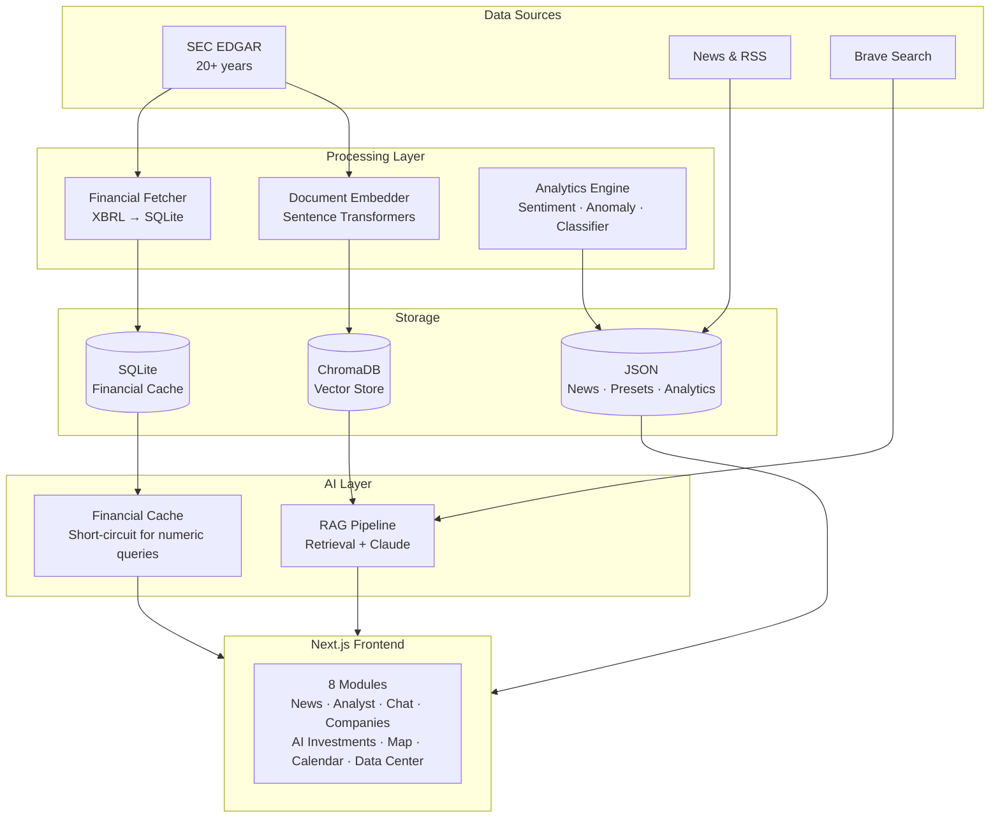

# EMS Intelligence Platform

> An AI-powered competitive intelligence platform for EMS sector analysis — tracking 11 companies across SEC filings, real-time news, earnings calls, and hyperscaler CapEx trends.

---

## What It Does

The EMS Intelligence Platform turns scattered public data into structured, queryable intelligence for the Electronics Manufacturing Services sector. It covers **6 EMS companies** (Flex, Jabil, Celestica, Benchmark, Sanmina, Plexus) and **5 hyperscalers** (Amazon, Google, Microsoft, Meta, Oracle), with 20+ years of financial history sourced directly from SEC EDGAR.

**8 modules:**

| Module | Description |
|--------|-------------|
| **News Intelligence** | Ranked news feed, SEC filings, trending keyword clusters across all companies |
| **Analyst View** | Wall Street consensus, price targets, earnings call Q&A, weekly AI-synthesized themes |
| **AI Chat** | Natural language financial queries — RAG over SEC filings, web search, or hybrid |
| **Companies Hub** | Per-company deep dives: financials, sentiment, CapEx trends, facility footprint |
| **AI Investments** | Hyperscaler CapEx tracker with 20+ years of history and YoY growth analysis |
| **Facilities Map** | Global facility heatmap extracted from SEC filings across all EMS companies |
| **Calendar** | Earnings dates and events calendar across all tracked companies |
| **Data Center** | SEC filing library (10-K, 10-Q, 8-K) with full-text search |

---

## Quick Start

```bash
# 1. Clone
git clone https://github.com/xcai2/EMS-Intelligence-Platform.git
cd EMS-Intelligence-Platform

# 2. Set up API keys
cp backend/.env.example backend/.env
# Edit backend/.env — add ANTHROPIC_API_KEY and BRAVE_API_KEY

# 3. Frontend env
echo "NEXT_PUBLIC_API_URL=http://localhost:8001" > frontend/.env.local

# 4. Install dependencies
pip install -r backend/requirements.txt
cd frontend && npm install && cd ..

# 5. Start backend (Terminal 1)
uvicorn backend.main:app --host 0.0.0.0 --port 8001

# 6. Start frontend (Terminal 2)
cd frontend && npm run dev
```

**App:** http://localhost:3000 &nbsp;|&nbsp; **API Docs:** http://localhost:8001/docs

> See [SETUP.md](SETUP.md) for detailed setup, prerequisites, and ChromaDB build instructions.

---

## Architecture



---

## Financial Data Pipeline

The platform uses **SEC EDGAR Company Facts API** as the primary financial data source — not third-party vendors. This provides XBRL-tagged financial history going back 20+ years, free and authoritative.

```
SEC EDGAR Company Facts API
    → XBRL concept mapping (GAAP → normalized field names)
    → Fiscal year normalization (6 EMS companies, 6 different fiscal year endings)
    → SQLite financial cache (aichat_financials.db)
    → Sub-second query response for numeric financial questions
```

For numeric queries (CapEx, Revenue, Net Income, etc.), the AI Chat **bypasses the LLM entirely** and returns answers directly from SQLite — response in under 1 second vs. 15+ seconds via RAG.

---

## AI Chat Query Modes

| Mode | How It Works | Best For |
|------|-------------|----------|
| **RAG** | Embeds query → ChromaDB retrieval → Claude synthesis with citations | Qualitative questions about strategy, management language, filings |
| **Web Search** | Brave Search API → Claude synthesis | Current events, recent news |
| **Hybrid** | RAG + Web Search merged | Comprehensive answers combining filings and live data |
| **Financial Cache** | Direct SQLite lookup, no LLM | Numeric queries: CapEx, Revenue, margins, YoY growth |

---

## Tech Stack

| Layer | Technology |
|-------|------------|
| **Backend** | Python · FastAPI · APScheduler |
| **AI** | Claude API · Sentence Transformers (all-mpnet-base-v2) |
| **Vector DB** | ChromaDB |
| **Financial DB** | SQLite (SEC EDGAR XBRL data, 20+ years) |
| **Financial Data** | SEC EDGAR Company Facts API |
| **Web Search** | Brave Search API |
| **Frontend** | Next.js · Tailwind CSS · shadcn/ui · Recharts · Leaflet |

**Running cost: ~$20–50/month** (Claude API only — everything else is free)

---

## Tracked Companies

| Type | Company | Ticker | Fiscal Year End |
|------|---------|--------|----------------|
| EMS | Flex | FLEX | March |
| EMS | Jabil | JBL | August |
| EMS | Celestica | CLS | December |
| EMS | Benchmark Electronics | BHE | December |
| EMS | Sanmina | SANM | September |
| EMS | Plexus | PLXS | September |
| Hyperscaler | Amazon | AMZN | December |
| Hyperscaler | Google | GOOGL | December |
| Hyperscaler | Microsoft | MSFT | June |
| Hyperscaler | Meta | META | December |
| Hyperscaler | Oracle | ORCL | May |

---

## Environment Variables

**`backend/.env`**
```bash
ANTHROPIC_API_KEY=sk-ant-...       # Required
BRAVE_API_KEY=BSA...               # Optional (web search mode)
SEC_USER_AGENT=YourApp/1.0 (your@email.com)
```

**`frontend/.env.local`**
```bash
NEXT_PUBLIC_API_URL=http://localhost:8001
```

---

## License

For educational and research purposes only.
