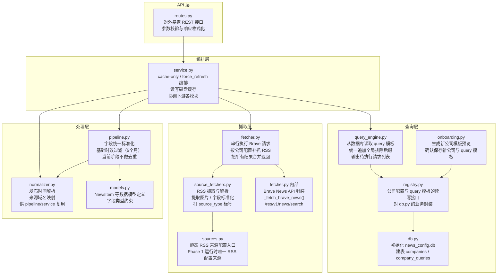
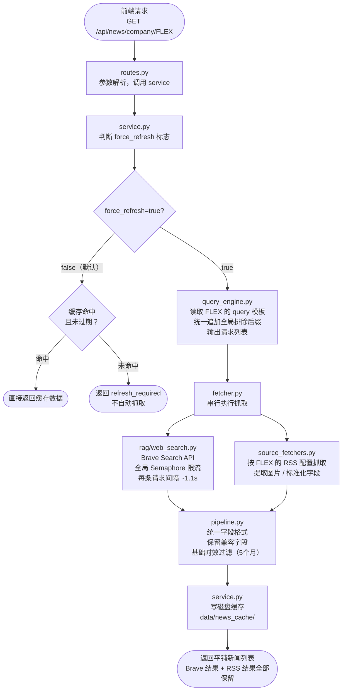

# 架构说明阶段一
> 本文件是 `backend/news` 模块的实现基线。  
> 当前目标不是一次把新闻系统做复杂，而是先把**可用、可观测、可迭代**的基础框架搭起来。  
> **Brave Search API 是核心来源，必须保留。**
---
## 一、这版文档的目标
这一版设计说明只回答四件事：
1. 新闻怎么抓
2. query 怎么发、缓存怎么用
3. 当前有哪些限制条件
4. 现在先做什么，不做什么
这版文档**刻意不追求复杂能力**。先把基础链路跑通，再根据真实返回数据慢慢补规则。
---
## 二、Phase 1 的明确范围
### 2.1 当前必须实现的能力
- 使用 **Brave Search API** 抓取新闻
- 按公司配置补充抓取 **公司 RSS feeds**
- 支持按公司模板发送少量宽 Brave query
- 使用磁盘缓存，避免每次请求都打外部源
- 返回平铺新闻列表，供前端先看“原始抓取效果”
- 标准化公司、时间、来源等展示必需字段
- 支持“按公司查看”与前端本地关键词筛选
### 2.2 当前明确不做的能力
以下能力在 Phase 1 **先不做，或先不作为正式规则写死**：
- 事件级去重
- 相似标题归并
- 复杂的 Top News 候选筛选
- Trending 聚类
- Top News / Trending 的复杂排序策略
- 基于 `source_count` 的重要性打分
- 复杂过滤规则（公司相关性、黑名单域名、噪音词库等）
但这条边界不包括**同 URL 的严格重复折叠**。  
如果多条 Brave query 命中了完全相同的 URL，Phase 1 允许在 `pipeline.py`
做最低风险的精确去重，避免同一网页被重复写入缓存。

这样做的原因很直接：
- 现在最大问题不是“新闻太多”，而是“处理过度后几乎刷不出新闻”
- 在没有足够观察原始返回数据之前，过早做去重和排序，会把问题藏起来
- 先保留更多原始结果，才能看清 Brave 和 RSS 各自回来了什么
- Phase 1 不预先把新闻细分成很多固定主题类别
---
## 三、核心原则
1. **Brave 不能去掉**  
   Brave 是当前新闻系统的核心网页来源，必须保留。
2. **先精准 query，再看结果，不先做重处理**  
   先把 query 设计成“公司相关性召回”，把原始数据拿回来；当前阶段只允许最低风险的同 URL 精确去重，不提前做事件归并和复杂排序。
3. **先全量收录，再做展示层筛选**  
   当前阶段先把 Brave 和 RSS 回来的相关新闻尽量收进系统，再由前端基于公司维度和关键词做展示层筛选；不在后端预打过细主题类别。
4. **先做 cache-only + force_refresh 的明确模型**  
   默认走缓存；只有用户明确刷新，才抓 live。
5. **文档先于代码**  
   只有文档里写清楚的内容，代码才应该实现。
---
## 四、当前问题与本次收敛方向
### 4.1 旧方案的问题
旧方案的问题主要有两类：
- query 太宽，Brave 会带回大量噪音
- 后处理太重，尤其是去重和排序设计过早、过紧，结果把新闻压没了
### 4.2 新方案的收敛方向
本轮重构先做下面这件事：
**把 News 模块收敛成一条简单链路：**
```text
query_engine -> fetcher -> pipeline -> service cache -> routes
```
其中：
- `query_engine` 负责准备 Brave query
- `fetcher` 负责实际抓 Brave 和 RSS
- `pipeline` 当前阶段只做标准化、同 URL 精确去重和基础时间过滤
- `service` 负责 cache-only / force_refresh 编排
- `routes` 只负责 API 输出

---
## 五、文件结构
```text
backend/news/
│
├── routes.py
├── service.py
│
├── db.py
├── registry.py
├── query_engine.py
├── fetcher.py
├── pipeline.py
├── normalizer.py
├── onboarding.py
├── sources.py
├── source_fetchers.py
├── models.py
│
└── docs/
    ├── 架构说明阶段一.md
    └── source_catalog.md
```
当前阶段各文件职责如下：
| 文件 | 当前职责 |
|------|----------|
| `db.py` | 初始化 `news_config.db` |
| `registry.py` | 读写公司配置与 query 模板 |
| `query_engine.py` | 从数据库读取模板，构造 Brave 请求参数 |
| `fetcher.py` | 实际调用 Brave 和 RSS |
| `pipeline.py` | 轻量标准化与基础清洗 |
| `normalizer.py` | 发布时间解析、来源域名映射等可复用标准化辅助函数 |
| `models.py` | 定义 `Company`、`QueryTemplate`、`NewsItem` 等基础数据结构 |
| `service.py` | 缓存编排与 force refresh 逻辑 |
| `routes.py` | 对外暴露 API |
| `sources.py` | 静态来源配置入口 |
| `source_fetchers.py` | RSS 抓取、图片提取等底层实现 |
**本阶段不要求 `content_enricher.py` 和 `trending_cluster.py` 成为主流程的一部分。**  
如果文件还存在，可以保留，但不作为当前架构的核心链路。
### 5.1 `models.py` 当前必须定义的核心结构
虽然本阶段先不做复杂处理，但 `models.py` 仍应把基础数据结构写清楚，避免不同模块各自拼字段。

建议至少定义以下三个核心结构：
#### `Company`
| 字段 | 类型 | 说明 |
|------|------|------|
| `ticker` | `str` | 股票代码，全大写 |
| `full_name` | `str` | 公司全称 |
| `aliases` | `str` | 别名列表，逗号分隔 |
| `industry` | `str` | 行业分类 |
| `official_domain` | `str` | 官网域名，可为空 |
| `rss_feeds` | `str` | RSS 配置 JSON 字符串，可为空；字段当前仅作预留，不作为 Phase 1 运行时抓取来源 |
| `template_tier` | `str` | `enhanced` 或 `standard` |
| `created_at` | `str` | ISO 8601 时间 |
#### `QueryTemplate`
| 字段 | 类型 | 说明 |
|------|------|------|
| `id` | `int \| None` | 数据库自增主键，新建时可为空 |
| `ticker` | `str` | 所属公司 ticker |
| `intent` | `str` | 模板标识或用途；当前阶段固定使用 `official_name`、`industry_news`、`stock_news`、`supporting_query` |
| `query_template` | `str` | 基础 Brave query 模板；只存公司级正向检索词，不存统一排除后缀 |
| `freshness` | `str \| None` | Brave 附加时间提示参数；当前阶段默认保持 `null`，不作为 5 个月窗口的主实现方式 |
| `count` | `int` | 该 query 请求的结果数 |
| `updated_at` | `str \| None` | 最后修改时间 |
#### `NewsItem`
`pipeline.py` 标准化后的输出，类型为 `list[NewsItem]`。  
`service.py` 在缓存写入边界处调用 `item.to_dict()` 完成序列化，不在 `pipeline.py` 内部转成 `dict`。

当前阶段至少应包含以下字段：
| 字段 | 类型 | 说明 |
|------|------|------|
| `title` | `str` | 新闻标题 |
| `url` | `str` | 原文链接 |
| `source` | `str` | 来源显示名，如 `Reuters`、`Flex IR` |
| `source_type` | `str` | 统一来源类型枚举值，见第 5.2 节 |
| `published` | `str` | ISO 8601 时间字符串；优先来自结构化时间字段，其次允许从标题里的显式日期做简单兜底 |
| `description` | `str` | 摘要或 snippet |
| `image_url` | `str` | 图片地址，没有则为空字符串 |
| `intent` | `str \| None` | 命中该新闻的 query intent；RSS 可为空 |
| `categories` | `list[str]` | 兼容保留字段；Phase 1 不再依赖它承载固定主题分类，默认可为空列表 |
| `content` | `str \| None` | 正文增强字段，当前阶段可为空 |
### 5.2 `source_type` 与 RSS `kind` 的固定枚举
为了避免实现时各写各的字符串，当前阶段先把合法值写死。
#### RSS `kind`
当前 Phase 1 运行时只使用 `sources.py` 中的静态 RSS 配置。  
数据库 `companies.rss_feeds` 字段可以保留，但当前阶段不参与运行时抓取。  
在 `sources.py` 中，每条 RSS feed 的 `kind` 仅允许以下值：
| `kind` | 含义 |
|--------|------|
| `news` | 公司官方新闻/IR 新闻稿 |
| `sec_filing` | SEC Filing RSS |
| `market_commentary` | 第三方评论型 RSS，如 Seeking Alpha |
#### `source_type`
`pipeline.py` 输出给上层的 `NewsItem.source_type` 当前阶段仅允许以下值：
| `source_type` | 含义 | 来源示例 |
|--------------|------|----------|
| `brave` | Brave Search 网页结果 | Reuters、Bloomberg、Yahoo Finance 等经 Brave 返回的网页 |
| `company_news_rss` | 公司官方新闻类 RSS | `pressrelease.aspx`、官网 feed |
| `sec_filing_rss` | SEC Filing RSS | 公司 IR 的 SEC feed |
| `market_commentary_rss` | 第三方评论型 RSS | Seeking Alpha RSS |
当前阶段实现必须复用这四个值，不允许自行发明新的命名。

当前前端展示层应直接把这个字段可视化出来，至少要让用户区分：
- `brave` → `Web`
- `company_news_rss` → `IR RSS`
- `sec_filing_rss` → `SEC RSS`
- `market_commentary_rss` → `Commentary RSS`

也就是说，`source` 负责显示“来源名”，`source_type` 负责显示“来源类型”，两者不能混成一个字段理解。

#### 5.2.0.1 为什么需要 `normalizer.py`
当前阶段文档仍然把“标准化”看作 `pipeline.py` 的职责。  
代码里把可复用的基础工具抽到 `normalizer.py`，是因为这些逻辑会被 `pipeline.py` 和 `service.py` 共同复用。

`normalizer.py` 当前主要负责两件事：
1. 发布时间解析
2. 来源域名映射

职责划分可以简单理解成：
```text
pipeline.py 负责标准化流程
normalizer.py 负责标准化过程中复用的基础工具
```

#### 5.2.0.2 当前 Phase 1 的 Normalize 规则
当前阶段的目标不是做深度内容理解，而是把最基础、最稳定的展示字段整理出来。

Phase 1 当前已经做的事：
1. 优先读取结构化时间字段  
   - `published`
   - `published_at`
   - `date`
2. 如果结构化时间缺失，再允许从标题里的**显式日期**做简单兜底  
   例如：
   - `2026-04-15`
   - `April 15, 2026`
   - `15 Apr 2026`
3. 把可解析的时间统一转成 ISO 8601 UTC
4. 如果 Brave 结果没有 `source`，则根据 URL 域名补来源显示名
5. 对 Brave 结果做基础卫生过滤  
   仅限明显不是新闻正文的导航页、社交主页、原始 SEC 首页/文件页补漏过滤
6. 对完全相同的 URL 做严格去重  
   仅折叠同一 `source_type` 下的完全重复页面，不做标题近似归并，也不合并不同 FilingId 的 SEC 条目

如果前两步之后仍然没有可用时间：
- `published` 保持空字符串
- 前端展示层的时间位不应直接留空，应显示统一时间占位文案
- 来源名应只出现在来源位，不应拿来填充时间位

#### 5.2.0.3 当前 Phase 1 明确不做的事
1. 不打开新闻正文页面再去补抓发布时间
2. 不从标题里做模糊或复杂日期推断  
   例如只凭 `Q1 results`、`yesterday filing` 这类弱信号，不生成正式时间
3. 不做更复杂的媒体来源识别  
   当前主要靠原始 `source` 字段或域名映射表

因此下面这些情况仍然属于已知限制：
- 返回数据里没有时间，但网页正文里有时间
- 标题里没有显式日期，只有模糊时间提示
- 新站点或小站点域名不在映射表里，来源显示名不够理想

这些能力如果要补强，应进入 Phase 2 单独设计，而不是在 Phase 1 临时加很多特例。
#### 5.2.1 来源归类 vs 公司维度 vs 外部筛选
这里必须明确区分三件事：
1. **来源归类**
2. **公司维度**
3. **外部筛选**

来源归类回答的是：
```text
这条新闻是从哪里来的
```
它对应：
- RSS feed 级别的 `kind`
- NewsItem 级别的 `source_type`
例如：
- `brave`
- `company_news_rss`
- `sec_filing_rss`

公司维度回答的是：
```text
这条新闻当前属于哪个公司上下文
```
在 Phase 1 里，这个维度必须和前端“按公司查看”的功能严格对应。  
当前阶段允许两种等价实现：
- 通过 `/api/news/company/{ticker}` 的接口上下文表达公司归属
- 前端在聚合多家公司结果时，为每条新闻补上所属 `ticker`

这里最重要的结论是：
```text
公司维度是 Phase 1 唯一必须稳定存在的正式筛选维度
```

外部筛选回答的是：
```text
用户现在想在当前新闻集合里额外找什么主题
```
它不是新闻本身的固定分类。  
例如：
- `Data Center`
- `Cooling`
- `AI`
- 用户手动输入的任意关键词

因此当前阶段必须遵守一条规则：
```text
不能把“前端主题筛选”直接写成后端固定 categories
```
也就是说：
- `Flex + Data Center` 仍然首先是 `FLEX` 公司的新闻
- 不需要因为提到了 `Data Center`，就在后端额外生成一个固定新闻类别
- 主题词更适合作为前端在当前结果集合上的二次筛选条件

#### 5.2.2 Phase 1 的主题筛选定义
Phase 1 的主题筛选采用最简单、最可解释的方式：
```text
前端本地关键词筛选
```

典型交互例如：
- 公司选 `All`
- 主题标签点 `Data Center`
- 或在输入框里手动输入 `cooling`
- 系统在当前已经拿到的新闻集合里做关键词匹配，筛出命中的结果

这意味着：
- `All` 只是前端公司范围选择，不写入 `NewsItem.categories`
- `Data Center`、`Cooling`、`AI` 只是前端筛选标签，不写入 `NewsItem.categories`
- 后端不再维护一套固定主题枚举给前端强绑定使用

#### 5.2.3 Phase 1 的实现限制
当前阶段主题筛选必须保持简单：
- 不使用 LLM
- 不向外部模型发分类请求
- 不做向量召回或语义搜索
- 不把主题筛选升级成运行时复杂配置系统

Phase 1 允许的实现方式是：
1. 预置少量固定主题标签  
   例如：`Data Center`、`Cooling`、`AI`
2. 每个主题标签对应一组人工维护的基础关键词
3. 同时提供自由输入框，允许用户手动输入关键词
4. 匹配范围先限制在 `title`、`description`、`source`，必要时可补充公司名

换句话说，当前阶段的方法论就是：
```text
公司维度走显式筛选；主题维度走前端关键词匹配；不调用 LLM
```

#### 5.2.3.1 重复新闻的临时调试标注
Phase 1 当前允许保留部分重复新闻，其目的不是最终展示，而是为了观察：
- 哪些 Brave query 实际命中了结果
- 同一篇网页是否被不同 query 重复召回
- 当前 query 模板是否存在明显重叠

因此，Phase 1 前端可以临时显示这类调试信息：
- `intent`
- 命中的 query 文本或等价调试标识

但这里必须明确三条边界：
1. 这类标注只服务于 Phase 1 的调试观察，不属于正式产品字段
2. 当前允许在前端把重复新闻暂时展示出来，并标出它们分别来自哪条 query
3. Final Version 必须移除这类“重复命中调试标注”，不作为正式展示能力长期保留

也就是说，Phase 1 可以接受下面这种临时现象：
```text
同一条 Reuters 新闻在前端出现两次，
分别标注它来自 official_name 和 stock_news
```

这不是最终产品形态，而是为了帮助开发阶段理解 query 召回路径。

#### 5.2.4 `categories` 字段的当前口径
当前代码里仍然保留 `NewsItem.categories` 字段，是为了兼容已有返回结构。  
但从本版文档开始，Phase 1 不再要求后端用它承载固定主题分类。

因此当前阶段应按下面的口径理解：
- `categories` 可以为空列表 `[]`
- 前端主题标签不应依赖后端预打的固定 `categories`
- 如果后续确实要引入少量稳定内部标签，必须先补文档再定是否复用该字段

#### 5.2.5 关键词表的实现要求
为了避免实现分叉，当前阶段还要明确：
- 主题标签对应的关键词表由程序员直接写在代码中维护
- 关键词表可以人工调整，但当前阶段不引入后台配置页
- 自由输入框直接按用户输入做匹配

这里的关键词表当前只服务于一件事：
1. 前端主题筛选

但 Phase 1 的方法论不能变：
```text
先用固定关键词匹配，不调用 LLM
```
#### `source_type` 扩展规范（预留）
后续新增来源类型时，必须先补本文档，再改代码。新增时至少要补三项：
1. 新值名称
2. 它对应的原始来源类别
3. 它在 `fetcher.py` / `source_fetchers.py` 中如何映射出来
### 5.3 文件依赖关系图

> **图例说明**  
> - 每个节点第一行是文件名，后续行是该文件的核心职责  
> - 箭头方向表示"调用/依赖"关系  
> - `rag/web_search.py` 属于 `rag` 模块，但被 `fetcher.py` 直接依赖，故在此标出
---
## 六、数据库与配置
### 6.1 数据库定位
news 模块使用独立的 `news_config.db`，只存**配置**，不存抓取结果。

数据库文件：
```text
DATA_DIR / "news_config.db"
```
只包含两张表：
```text
companies
company_queries
```
### 6.2 两张表的用途
`companies`：
- 公司基本信息
- RSS feeds 预留字段
- 模板层级（`enhanced` / `standard`）
`company_queries`：
- 每家公司的 Brave 宽 query 模板
- 每条模板的标识名 `intent`
- `freshness`
- `count`
可以把这两张表理解成：
- `companies`：先告诉系统“我们现在跟踪哪些公司”
- `company_queries`：再告诉系统“每家公司应该怎么搜”
这里还要额外明确：
```text
Phase 1 运行时只使用 sources.py 里的静态 RSS 配置
```
也就是说：
- `companies.rss_feeds` 字段当前可以保留
- 但当前阶段不把它作为 fetcher 的实际配置来源
- 程序员当前不应实现 “数据库有值则覆盖 sources.py” 或 “两者合并” 这类双来源逻辑
这样做的原因很简单：
- 基础版本先把 RSS 来源写死，边界最清楚
- 避免静态配置和数据库双写后出现优先级冲突
- 以后如果需要动态维护 RSS，再放到第二阶段设计
当前阶段这里的“怎么搜”，不是指按很多细主题去拆 query，而是指：
- 用准确公司名称做识别
- 适当补辅助限定词做消歧
- 用少量宽 query 抓公司相关新闻
- 对所有 Brave query 统一附加低风险排除后缀，减少直接命中 `sec.gov`
当前阶段 `company_queries` 的写法需要固定下来，避免不同实现者各写各的：
- 一家公司默认写 **4 行**
- 每一行对应一个固定 `intent`
- 不在数据库里写 `earnings`、`press_release` 这类财报/公告型细主题模板
这里还要再明确一条：
```text
Phase 1 不再区分“preview 草稿规则”和“正式模板规则”两套口径
新增公司时，preview 必须按正式模板规则生成 4 条固定模板
```
当前阶段固定的 4 个 `intent` 如下：
| `intent` | 含义 | query 示例 |
|---------|------|-----------|
| `official_name` | 公司正式名称 + `news`，召回官方公告/外部报道 | `"Jabil Inc." news` |
| `industry_news` | 公司短名称 + `manufacturing` + 领域短语 + `news`，提高新闻相关性 | `Jabil manufacturing electronics news` |
| `stock_news` | 用 ticker + 财报/结果型关键词召回财经文章 | `JBL earnings results quarterly` |
| `supporting_query` | 优先使用别名；无别名时退回短名称 + 领域短语 + `news` | `Flextronics news` / `Sanmina supply chain news` |

**Query 设计规则（Phase 1 必须遵守）：**
1. **每条 query 必须含至少一个新闻信号词**（`news`、`earnings`、`results`、`quarterly`、`announcement` 之一）  
   没有信号词时，Brave 会返回公司概览页、Wikipedia、Bloomberg 公司简介等静态资料页，不是新闻
2. **`official_name` 不能只放公司名**  
   `"Flex Ltd."` 单独作为 query 会把 Wikipedia、Bloomberg 公司档案页排在前面  
   正确写法：`"Flex Ltd." news`
3. **`stock_news` 不能用 `TICKER stock news` 模式**  
   `FLEX stock news` 召回的是 Yahoo Finance/Reuters/CNBC 的 ticker 聚合主页（一个页面显示所有新闻），不是独立文章  
   正确写法：`FLEX earnings results quarterly`（召回财报分析文章和业绩报道）
4. **所有 query 只存公司级正向检索词**  
   `-site:sec.gov` 等全局排除后缀由 `query_engine.py` 统一追加，不写进 `company_queries` 表
也就是说，程序员写 `company_queries` 时，当前阶段默认就是：
```text
每家公司 4 条 Brave 模板
对应 official_name / industry_news / stock_news / supporting_query
```
这里还要额外明确一条：
```text
数据库里的 query_template 只保存公司级正向检索词
```
像 `-site:sec.gov` / `-site:www.sec.gov` 这种统一排除后缀，不建议写死在每一行 `company_queries` 里，  
而应由 `query_engine.py` 在实际构造 Brave 请求时统一追加。

举例：
- `companies` 里的一条记录可能是：
```text
ticker = FLEX
full_name = Flex Ltd
template_tier = enhanced
```
表示：
```text
系统里有一家公司叫 FLEX，它属于增强模板公司
```
- `company_queries` 里的一条记录可能是：
```text
ticker = FLEX
intent = official_name
query_template = "Flex Ltd." news
freshness = null
count = 40
```
表示：
```text
对于 FLEX，要有一条 `official_name` 类型的基础 Brave query，
它优先按准确公司名去抓相关新闻，单次最多拿 40 条结果
```
如果写完整的 `company_queries`，则当前阶段默认应写成类似：
```text
ticker = FLEX, intent = official_name,   query_template = "Flex Ltd." news,                          freshness = null, count = 40
ticker = FLEX, intent = industry_news,   query_template = Flex manufacturing supply chain news,       freshness = null, count = 40
ticker = FLEX, intent = stock_news,      query_template = FLEX earnings results quarterly,             freshness = null, count = 40
ticker = FLEX, intent = supporting_query,query_template = Flextronics news,                            freshness = null, count = 40
```
为了避免程序员不知道两张表要怎么配合写，下面给一个“新增一家公司”时的完整落表示例。
#### 6.2.1 完整落表示例
假设现在要把 `FLEX` 加入系统，那么两张表应该同时写成下面这种结构。

**`companies` 表示例：**
| 字段 | 示例值 | 说明 |
|------|--------|------|
| `ticker` | `FLEX` | 公司 ticker，主键级标识 |
| `full_name` | `Flex Ltd` | 公司正式名称 |
| `aliases` | `Flextronics` | 常见别名，多个值可逗号分隔 |
| `industry` | `EMS` | 当前公司所属行业 |
| `official_domain` | `flex.com` | 官网域名 |
| `rss_feeds` | `[{...}, {...}]` | RSS 配置预留 JSON；当前 Phase 1 运行时不直接读取此字段 |
| `template_tier` | `enhanced` | 当前阶段可保留模板层级字段 |
可以理解为一行：
```text
ticker = FLEX
full_name = Flex Ltd
aliases = Flextronics
industry = EMS
official_domain = flex.com
rss_feeds = [
  {"kind":"news","url":"https://investors.flex.com/rss/pressrelease.aspx","source_name":"Flex IR"},
  {"kind":"sec_filing","url":"https://investors.flex.com/rss/SECFiling.aspx?Exchange=CIK&Symbol=0000866374","source_name":"Flex SEC"}
]
template_tier = enhanced
```
这组 `rss_feeds` 在当前阶段可以作为数据库中的预留镜像存在，但运行时仍以 `sources.py` 为准。
**`company_queries` 表示例：**
| `ticker` | `intent` | `query_template` | `freshness` | `count` |
|---------|----------|------------------|-------------|---------|
| `FLEX` | `official_name` | `"Flex Ltd." news` | `null` | `8` |
| `FLEX` | `industry_news` | `Flex manufacturing supply chain news` | `null` | `8` |
| `FLEX` | `stock_news` | `FLEX earnings results quarterly` | `null` | `8` |
| `FLEX` | `supporting_query` | `Flextronics news` | `null` | `8` |
程序员在实现时可以直接按下面这个心智模型去写：
```text
companies：一家公司一行，负责描述“这是谁”和“它的 RSS 是什么”
company_queries：同一家公司四行，负责描述“Brave 应该怎么搜它”
```
所以当前阶段新增一家公司，最少要完成两件事：
1. 在 `companies` 写入 1 行公司配置  
2. 在 `company_queries` 写入 4 行固定 Brave 模板
如果只写 `companies` 不写 `company_queries`，那系统知道“有这家公司”，但不知道怎么向 Brave 搜。  
如果只写 `company_queries` 不写 `companies`，那系统缺少 RSS 配置、公司名称、行业等主信息，也是不完整的。

当前还要额外明确：
```text
新增公司时，系统当前只自动生成 Brave query 模板
不会自动发现或自动补入 RSS feeds
```

也就是说：
- 前端输入公司名后，后端可以自动生成并保存 4 条 Brave 模板
- `rss_feeds` 默认可以为空
- 如果以后要补公司 RSS，需要人工在 `sources.py` 或后续配置入口里显式增加

这里两个字段最容易让人卡住：
- `freshness`
  表示是否给 Brave 附加一个额外的时间提示参数  
  但当前阶段的主规则不是靠它来决定结果范围，而是统一以后处理层的“最近 5 个月窗口”为准  
  所以当前阶段它默认保持 `null`
- `count`
  表示这条 query 最多向 Brave 要多少条结果  
  例如：
  - `count = 40` = 最多取 40 条
  - `count = 6` = 最多取 6 条
### 6.3 建表原则
- 启动时只做 `CREATE TABLE IF NOT EXISTS`
- 不允许每次启动重建表
- 不允许刷新新闻时重建表
这三条规则的意思其实很简单：
- 系统第一次启动时，如果表不存在，就创建
- 如果表已经存在，就直接继续用
- 用户点击刷新新闻时，只允许抓新闻，不允许碰数据库表结构
也就是说：
```text
“刷新新闻” 和 “建表” 是两件完全不同的事
```
### 6.3.1 现在怎么查看这两张表
当前文档里的两张表是 SQLite 表，数据库文件是：
```text
DATA_DIR / "news_config.db"
```
开发阶段查看它们，通常有两种方式：
1. 直接用 SQLite 工具查看  
   例如：
   - DB Browser for SQLite
   - SQLite Viewer
   - `sqlite3` 命令行
2. 通过后端接口间接查看  
   例如公司管理接口或未来的管理页面

当前阶段文档没有要求必须做一个专门的“可视化配置页面”，所以默认理解是：
```text
开发时先直接看 SQLite 数据库文件
```
### 6.4 启动初始化的幂等性
与数据库初始化相关的启动动作必须是**幂等的**。

“幂等”这个词可以直接理解成：
```text
同一个动作重复执行很多次，结果都一样，不会越做越乱
```
包括：
- `db.py` 的 schema init
规则必须写死如下：
1. 已有表时：
   不报错，不重建，不清空
2. 启动初始化失败时：
   只记录错误，不得破坏已有数据

也就是说，启动初始化是：
```text
可以重复执行，但重复执行时不应产生副作用
```
这部分是启动阶段的幂等性要求，不是运行时新闻抓取逻辑的一部分。

当前 Phase 1 还要明确一条边界：
```text
启动时只允许做 schema init，不自动 seed 初始公司，不自动写入默认 query 模板
```

也就是说：
- 启动时只做 `CREATE TABLE IF NOT EXISTS`
- 启动时不自动补默认 6 家公司
- 启动时不自动同步已有公司配置
- 公司和 query 的新增、修改、删除，都应通过显式数据库操作或 onboarding API 完成

这样做的原因是：
- 数据库应作为当前配置的唯一真实来源
- 避免“代码里的默认公司列表”和“数据库中的实际配置”长期漂移
- 避免用户主动删除或调整配置后，应用重启又把默认数据补回来

这里举一个最直接的例子：
#### 例子：建表
第一次启动：
- `companies` 不存在
- `company_queries` 不存在
- 系统创建它们
第二次启动：
- 这两张表已经存在
- 系统什么都不重建，直接跳过
这就叫幂等。
---
## 七、新闻抓取方式与逻辑
### 7.1 总体逻辑
对单家公司新闻，抓取链路如下：
```text
前端请求 /api/news/company/{ticker}
    -> service.py
    -> query_engine.py
    -> fetcher.py
        -> Brave Search API
        -> RSS feeds
    -> pipeline.py
    -> 写缓存
    -> 返回平铺新闻列表
```
### 7.2 Brave 的角色
Brave 是当前新闻系统最重要的**通用**网页来源。  
在当前 Phase 1 中，它的主用途是：
- 单公司新闻
**Brave 是基础设施，不专属于任何一个视图。** 每个视图都可以向 Brave 发送 query，不存在"某个视图只能用 Brave"或"Brave 只服务于某个视图"的限制。

这里的“视图”不是指某个前端页面样式，而是指系统里的一个功能模块或数据视角。  
例如：
- `news` 模块
- `analyst_view` 模块
- 未来如果有别的情报视图，只要需要网页检索，也都可以复用 Brave
也就是说，这里强调的是：
```text
Brave 是底层检索能力，不是某一个业务模块私有的接口
```
**Brave 绝对不能移除。**
### 7.3 RSS 的角色
RSS 是按公司维度补充的稳定来源，用于：
- 官方新闻稿
- SEC Filing
- 第三方评论型 RSS（如 Seeking Alpha）
RSS 是 Brave 的补充，不替代 Brave。
### 7.4 Query 发送方式
`query_engine.py` 负责：
- 从数据库读取该公司的 query 模板
- 生成少量宽 query，用于抓这家公司的相关新闻
- 动态拼接当前时间窗口
- 统一追加低风险全局排除后缀（当前阶段为 `-site:sec.gov` 与 `-site:www.sec.gov`）
- 补上 `count`
- 产出一组待执行请求
`fetcher.py` 负责：
- 逐条执行 Brave 请求
- 按公司配置补充抓 RSS
- 把所有原始结果放到同一个列表里返回
### 7.4.1 Query 不是自然语言提问，而是“检索词组合”
这里要特别说明：
我们写给 Brave 的 query，不是平时聊天那种自然语言问题。

不是这种：
```text
What is the latest news about Flex?
```
而更像这种：
```text
"Flex Ltd." electronics manufacturing -site:sec.gov -site:www.sec.gov
```
也就是说，当前 Phase 1 的 query 更接近：
```text
准确公司名称 + 少量辅助限定词 + 统一低风险排除后缀
```
它本质上是检索词组合，不是完整问句。
### 7.4.2 当前 query 的通用写法
当前阶段建议的通用写法是：
```text
准确公司名称 + 可选辅助限定词
```
对于容易歧义的公司，更推荐写成：
```text
公司正式名 / 常见别名 / ticker earnings results quarterly / 公司专属辅助限定词
```
其中：
#### 1. 公司识别词
当前阶段默认理念是：
```text
充分相信 Brave 的搜索相关性能力
```
只要我们提供的公司名称足够准确，不依赖歧义很强的短缩写，Brave 通常就能找到相关的公司新闻。  
因此 Phase 1 的重点不是人为把 query 限得很死，而是先把“公司是谁”表达准确。

用于让 Brave 明确知道“你到底在搜哪家公司”。

常见组成包括：
- 公司常用名
- 公司全称
- 公司别名
- 较长、较准确、能稳定消歧的公司表述
这里要特别注意：
- 重点不在于机械补公司后缀
- 重点在于“公司识别是否准确”
- 3~4 个字母的 ticker 默认**不作为主识别词**
也就是说，优先级应该是：
```text
正式名称 / 常见别名 / 能稳定消歧的较长公司表述 / 可选辅助限定词
```
而不是：
```text
只因为形式上像公司名，就把 Ltd / Inc. / Corp. 之类后缀随意堆进去
```
当前阶段不假设“某些公司可以直接裸用”。  
所有公司都应优先补能真正帮助 Brave 识别公司的名称、别名和辅助限定词。  
像 `FLEX`、`JBL`、`BHE` 这类短 ticker，在当前阶段默认不单独作为主锚点使用，但可以保留在 `stock_news` 模板里。
#### 1.1 辅助限定词
辅助限定词当前是**可选辅助项**，不是默认必须项。  
只有在公司名称本身仍然容易歧义，或者搜索结果需要进一步提高相关性时，才建议补上。

当前阶段常见的辅助限定方式包括：
- 行业词：
  - `electronics news`
  - `electronics manufacturing`
  - `manufacturing`
  - `EMS`
- 财经词：
  - `earnings results quarterly`
- 公司特定补充词：
  - `automation news`
  - `data center infrastructure news`
  - `AI news`
  - `supply chain`
这些词不是为了提前删掉某类新闻，而是为了让 Brave 更稳定地理解“你要找的是这家公司的相关新闻”。  
当前阶段不建议任何公司只保留纯公司名 query，默认都应配一条或多条辅助限定写法。
#### 2. 为什么仍然保留多条 query
当前阶段 Brave query 的目标仍然是尽量抓到这家公司的相关新闻。  
但具体写法不再只靠统一的 `news / company news / latest news / recent news` 四个短语，而是允许按公司特点做轻度调整。

当前阶段固定保留 4 类模板：
- `official_name`
- `industry_news`
- `stock_news`
- `supporting_query`
其中：
- `official_name`：保证最基础的公司召回
- `industry_news`：补行业相关性
- `stock_news`：补财经媒体结果
- `supporting_query`：按公司噪音情况做最后一条辅助查询
这样做的目的，不是按主题硬过滤，而是：
```text
用少量不同写法，从不同入口把同一家公司的相关新闻补回来
```
#### 2.1 Phase 1 的排除词策略
程序员建议的排除词需要分成两类看：
- 可以进入 Phase 1 的低风险排除：
  - `-site:sec.gov`
  - `-site:www.sec.gov`
  - `-site:www.sec.gov`
- 暂不进入 Phase 1 默认规则的高风险排除：
  - `-earnings`
  - `-quarterly`
  - `-"results"`
  - `-"conference call"`
当前阶段只建议把：
```text
-site:sec.gov -site:www.sec.gov
```
作为统一的全局排除后缀。

原因是：
1. `sec.gov` 本身就是结构化官方源，已经可以由 RSS / SEC feed 覆盖  
2. 排除 `sec.gov` 能减少 Brave 直接带回 SEC 文件页，降低与 RSS 的直接重复  
3. 这个排除条件比较窄，不会大面积误伤正常媒体报道
而像：
```text
-earnings -quarterly -"results" -"conference call"
```
虽然也能减少部分重复，但风险更高，因为它们会同时删掉很多仍然有价值的第三方媒体报道。  
例如一篇 Reuters 财报新闻，标题里很可能就带有 `earnings` 或 `results`。  
这类负向词优化先留到第二阶段，在观察完真实抓取结果后再决定。
#### 3. 动态时间窗口
当前阶段统一使用：
```text
以抓取当天为基准，向前回溯 5 个月
```
这个时间窗口是动态的，不写死某个固定年份。

规则分两部分：
1. Brave 侧  
   Brave query 以“最近 5 个月的相关新闻”为目标范围
2. RSS 侧  
   RSS 继续作为稳定补充来源抓入系统  
   当前阶段统一保留最近 6 个月（约 180 天 / 2 个季度）以内的内容

这里还要把实现方式写清楚：
1. 当前 Brave 封装支持的 `freshness` 只有：
   - `pd` = past day
   - `pw` = past week
   - `pm` = past month
   - `py` = past year
2. 这些值里没有“最近 5 个月”这种精确选项  
   因此当前阶段不依赖 Brave 的 `freshness` 参数来精确实现 5 个月窗口
3. 当前阶段的正式规则是：
   - `QueryTemplate.freshness` 默认保持 `null`
   - Brave 请求正常发出，不额外传精确 5 个月参数
   - 新闻抓回后，再由后处理层对 `published` 做统一硬过滤
   - Brave 侧按最近 5 个月过滤
   - RSS 侧按最近 6 个月过滤

也就是说：
```text
Phase 1 的时间窗口最终靠后处理硬过滤：
Brave = 5 个月
RSS = 6 个月
不靠 Brave freshness 精确表达
```
### 7.4.3 为什么 Flex 的 query 里要同时出现正式名、旧名、ticker 和辅助限定词
比如这条：
```text
"Flex Ltd." OR Flextronics OR FLEX EMS
```
看起来比普通搜索长很多，但这不是机械重复，而是在做“公司消歧”。

这里每一部分的作用分别是：
- `"Flex Ltd"`
  当前正式公司名
- `Flextronics`
  常见旧名 / 别名，用来覆盖仍在使用旧称的报道
- `FLEX`
  ticker，本身不应单独做主锚点，但在 `stock_news` 或组合 query 里可以作为补充
- `EMS`
  辅助限定词，用来进一步降低歧义

所以它不是在说：
```text
为了效果好，就必须把同一个词重复很多遍
```
而是在说：
```text
对于容易歧义的公司，需要把“公司识别词”写得更完整；ticker 可以作为补充；再按公司情况加一条辅助限定词；分类放到进系统以后再做
```
### 7.4.4 有没有统一的通用模板
有，但不是所有公司都完全一样。

可以先把它理解成一个基础模板族：
```text
1. 只写正式名称
2. 正式名称 + 行业/新闻词
3. ticker + earnings/results/quarterly
4. 一条公司专属 supporting_query
```
例如：
- 正式名称：
```text
"Jabil Inc."
```
- 行业新闻类：
```text
"Jabil Inc." electronics news
```
- 财经新闻类：
```text
JBL earnings results quarterly
```
- 公司专属辅助类：
```text
"Jabil Inc." automation news
```
但不同公司会有不同难度：
- `Flex` 这种名字歧义很强，就要同时利用正式名、旧名、ticker 和 EMS
- `Benchmark Electronics` 这种噪音大，就必须带 `Electronics`，并补 `EMS` / `supply chain`
- `Plexus` 这种名字容易跑到医学语境，就要补 `Corp.` 或 `manufacturing`
- `Celestica` 这类看起来较稳的公司，也不应直接裸用，仍然要配合 `Inc.`、财经词或行业辅助词
- `Celestica` 这类看起来较稳的公司，也不应直接裸用，仍然要配合 `Inc.`、财经词或行业辅助词
所以：
```text
有通用模板族，但每家公司的 4 条 query 应按公司本身的噪音和识别难度单独调整
```
### 7.5 当前阶段对抓取结果的处理原则
**当前阶段先不做去重，也不在抓取阶段删内容。**

也就是说：
- Brave 返回 8 条，就先保留这 8 条
- RSS 返回 5 条，就先保留这 5 条
- 就算它们描述的是同一件事，也先让它们都回来
- RSS 内容不做主题预筛选，但超过 6 个月的内容会被过滤掉
- Brave 侧也不按 `earnings` / `press release` / `AI` 这些细主题词做预筛选
当前阶段的核心原则是：
```text
先收进来，再分类展示；不是先过滤掉一部分，再只留下少量内容
```
当前目标是先看清：
- Brave 到底带回了哪些新闻
- RSS 到底补回了哪些内容
- 哪些重复是真重复，哪些只是“同一事件的不同报道”
- 在最近 5 个月窗口内，系统真实能抓到多少公司相关新闻
### 7.5.1 主题筛选不是后端分类
这里要特别说明：
- 当前阶段前端可以按主题标签或关键词筛新闻
- 但这不叫“后端分类”
- 这只是为了前端展示层切换
具体逻辑是：
1. 所有原始新闻先收进系统并写入缓存
2. 系统只标准化公司、时间、来源等展示必需字段
3. 当前端如果需要做额外主题筛选  
   应在当前新闻集合上按外部关键词或筛选规则检索
4. 如果前端选择 `All`，就展示全部新闻
这里再明确一条：
- Brave 和 RSS 最终都会先统一成 `NewsItem`
- 当前阶段不要求后端再给它们补一套固定主题类别
- 外部筛选不应反向写死成新闻自身的固定标签
也就是说：
- 原始新闻并没有被删掉
- 它们只是在展示层按公司范围和关键词被“筛选展示”
- 缓存里仍然保留完整原始结果
### 7.6 Industry / Comparative 处理方式
`industry` 和 `comparative` 不属于当前 Phase 1 的实现范围。

原因很简单：
- 它们不是单公司新闻抓取的主链路
- 它们的 query 设计、缓存策略、结果边界都还没有定稿
- 如果继续把它们留在本阶段正文里，容易被误读成“现在就应该实现”
因此当前阶段只明确一条规则：
```text
Phase 1 只落地 company news 主链路
```
而：
- `/api/news/industry`
- `/api/news/comparative`
这两类能力统一移到 [架构说明阶段二](/Users/gao/Desktop/Flex-Practicum-Project-2026/backend/news/docs/架构说明阶段二.md) 中继续设计。  
在当前阶段，程序员不应根据本节自行扩展实现。
---
## 八、缓存与 force_refresh 规则
### 8.1 基本原则
缓存继续使用磁盘缓存文件：
```text
data/news_cache/
```
不把新闻结果写入数据库。

缓存里保存的是当前阶段的**完整原始新闻集合**，不是某一个分类筛过之后的子集。
### 8.2 默认行为
默认：
- `force_refresh=false`
- 只读缓存
- cache miss 时返回空结果或 `refresh_required`
- **不自动抓外部 API / RSS**
这是有意设计，不是 bug。
这里还要把响应格式约定清楚。当前阶段推荐统一采用：
- HTTP `200`
- 响应体里显式返回一个布尔字段 `refresh_required`

也就是说，前端不应靠 HTTP 状态码去猜“是不是需要刷新”，而应直接看响应体字段。

当前阶段建议的基础返回形态至少包括：
```json
{
  "items": [],
  "top_news": [],
  "refresh_required": true
}
```

如果缓存命中，则返回：
```json
{
  "items": [...],
  "top_news": [...],
  "refresh_required": false
}
```

所以这里的判断规则应写成：
1. HTTP `200` 只表示“接口调用成功返回了结构化结果”
2. `refresh_required=true` 表示“当前没有足够缓存内容，需要用户显式刷新”
3. `refresh_required=false` 表示“当前结果来自已有缓存或缓存聚合，可以直接展示”
### 8.3 强制刷新行为
只有当：
```text
force_refresh=true
```
才触发 live 抓取：
```text
query_engine -> fetcher -> pipeline -> 写缓存
```
### 8.4 缓存 TTL
当前 TTL 仍定义为：
```text
48 小时
```
但要明确三条规则：
1. **force_refresh 返回 0 条时，不应写入缓存**
2. **抓取失败和“确实没有新闻”不是同一种状态，diagnostics 应能区分**
3. **force_refresh 不回退旧缓存**

也就是说，当前阶段：
- `force_refresh=true` 的返回结果只表达“这一次 live 抓取的真实结果”
- 如果这次抓取失败，不应自动拿旧缓存顶上继续返回
- 如果这次抓到了原始内容，但经过 `pipeline.py` 后变成 0 条，也不应自动拿旧缓存顶上继续返回

这样做的目的不是让前端更容易空，而是为了让开发阶段能明确看到：
- 是 Brave / API 没拿到
- 还是 RSS 没拿到
- 还是抓到了但被处理层过滤掉了

这里再把 `diagnostics` 的位置和最小结构约定清楚。当前阶段建议：
- `diagnostics` 放在响应体顶层
- 它是可选字段
- 当前阶段至少用于表达：
  - “抓取失败”
  - “无新闻”
  - “Brave / RSS / pipeline 各自发生了什么”

基础示例：
```json
{
  "items": [],
  "top_news": [],
  "refresh_required": false,
  "diagnostics": {
    "status": "no_news"
  }
}
```

如果是抓取失败，则可以是：
```json
{
  "items": [],
  "top_news": [],
  "refresh_required": false,
  "diagnostics": {
    "status": "fetch_failed",
    "message": "Brave request failed"
  }
}
```

当前阶段最低要求是：
1. `diagnostics.status = "no_news"`  
   表示已经完成抓取，但当前没有符合条件的新闻
2. `diagnostics.status = "fetch_failed"`  
   表示抓取过程本身失败
3. `diagnostics.status = "ok"`  
   表示当前最终返回了新闻，但仍可以附带来源侧诊断信息
4. 如果当前没有额外诊断信息  
   `diagnostics` 可以省略

#### 8.4.1 `force_refresh` 的详细诊断结构
当前阶段，建议 `force_refresh=true` 时返回更细的顶层诊断结构，便于前端直接显示原因。

推荐结构：
```json
{
  "diagnostics": {
    "status": "ok",
    "reasons": [
      {"code": "brave_empty", "detail": "Brave returned 0 items"}
    ],
    "sources": {
      "brave": {
        "attempted": 4,
        "ok": 0,
        "empty": 4,
        "failed": 0,
        "items_found": 0,
        "details": [...]
      },
      "rss": {
        "attempted": 2,
        "ok": 1,
        "empty": 1,
        "failed": 0,
        "items_found": 6,
        "details": [...]
      }
    },
    "pipeline": {
      "raw_items": 6,
      "normalized_items": 6,
      "after_age_filter_items": 6,
      "final_items": 6,
      "dropped_in_normalize": 0,
      "dropped_in_age_filter": 0
    }
  }
}
```

字段含义如下：
- `status`
  - `ok`：最终有新闻返回
  - `fetch_failed`：抓取阶段失败，且最终没有新闻
  - `no_news`：抓取阶段可能拿到了原始内容，但最终没有可返回新闻
- `reasons`
  - 给前端直接展示的简短原因列表
  - 例如：
    - `brave_fetch_failed`
    - `brave_empty`
    - `rss_fetch_failed`
    - `rss_empty`
    - `pipeline_filtered_all`
- `sources.brave`
  - Brave / API 侧执行情况
  - 包含 query 尝试次数、空结果次数、失败次数、总命中数
- `sources.rss`
  - RSS 侧执行情况
  - 包含 feed 尝试次数、空结果次数、失败次数、总命中数
- `pipeline`
  - 处理层数量变化
  - 用来回答“是没抓到，还是抓到了但被过滤掉了”

#### 8.4.2 需要支持的三类典型判断
为了让前端能解释当前结果，当前阶段至少应能区分下面三类情况：

1. Brave / API 没拿到，但 RSS 拿到了  
   - 最终可以返回新闻  
   - `diagnostics.status = "ok"`  
   - `reasons` 中可出现 `brave_empty` 或 `brave_fetch_failed`

2. RSS 没拿到，但 Brave / API 拿到了  
   - 最终可以返回新闻  
   - `diagnostics.status = "ok"`  
   - `reasons` 中可出现 `rss_empty` 或 `rss_fetch_failed`

3. Brave / API 或 RSS 拿到了原始内容，但最后被 `pipeline.py` 过滤没了  
   - 最终返回空列表  
   - `diagnostics.status = "no_news"`  
   - `reasons` 中应出现 `pipeline_filtered_all`

#### 8.4.2.1 与重复新闻观察有关的前端调试信息
如果当前阶段需要帮助开发者观察“同一篇新闻为什么会重复出现”，前端可以临时把下面这类信息可视化：
- `intent`
- 命中的 query 文本
- 该条记录来自 Brave 还是 RSS

这类信息的定位应始终是：
- 调试辅助信息
- 用于解释召回路径
- 不属于 Final Version 的正式 UI

因此本节建议明确：
```text
Phase 1 可以显示重复新闻的 query 命中标注，
但 Final Version 不保留这类调试性重复展示。
```

### 8.4.3 缓存与前端筛选的关系
当前阶段缓存和前端筛选要明确区分：
- 缓存保存全部原始新闻
- 前端先按公司范围组织这些新闻
- 再基于主题标签或自由关键词，对当前结果做本地筛选
例如：
- 选择公司 `FLEX`：只展示 `FLEX` 上下文的新闻
- 输入 `Data Center`：在当前全部新闻中按该外部条件筛出结果
- 选择 `All`：展示缓存中的全部新闻
### 8.5 为什么现在采用 cache-only
原因是：
- Brave 有速率限制
- 单次刷新本来就不便宜
- 用户需要明确知道“什么时候在看缓存，什么时候在看 live”
---
## 九、当前限制条件
### 9.1 Brave 速率限制
News 模块使用 `fetcher.py` 内部的 `_fetch_brave_news()` 封装，独立于 `rag/web_search.py`。  
（`rag/web_search.py` 是 RAG/对话检索专用，与 news 模块无关，不应复用。）

限制条件必须写清楚：
- 使用模块级 `asyncio.Semaphore(1)` — 定义在 `fetcher.py`
- 同一时刻只允许一个 Brave 请求在途
- 请求结束后有约 `1.1` 秒等待，保持 ~1 req/sec（Brave 免费层上限）
这意味着：
- 单家公司刷新不是并发打多条 Brave
- 当前阶段不应在 `/api/news/all` 上触发”全公司 live refresh”
- 这是基础设施约束，当前阶段不绕过

### 9.1.1 Brave News Search API 规范
当前 `_fetch_brave_news()` 对接的是 **Brave News Search 专用 endpoint**，不是通用 web 搜索。

#### Endpoint
```text
GET https://api.search.brave.com/res/v1/news/search
```

> **注意**：这是独立的新闻 endpoint，不是通用 web 搜索 `/res/v1/web/search`。  
> 两者的响应结构不同：
> - News endpoint：`data[“results”]`（平铺数组）
> - Web search endpoint：`data[“web”][“results”]`

#### 请求 Headers（必须）
| Header | 值 |
|--------|----|
| `Accept` | `application/json` |
| `Accept-Encoding` | `gzip` |
| `X-Subscription-Token` | `{BRAVE_API_KEY}` |

#### 请求参数
| 参数 | 类型 | 说明 |
|------|------|------|
| `q` | `str` | 搜索 query，支持布尔运算符和 `-site:` 排除 |
| `count` | `int` | 返回条数，**最大 50**（旧注释 20 是错误的） |
| `safesearch` | `str` | `off` / `moderate` / `strict`，当前使用 `moderate` |
| `freshness` | `str` | 可选时间过滤：`pd`=近一天，`pw`=近一周，`pm`=近一月，`py`=近一年 |

#### 响应字段映射
`data[“results”]` 是平铺数组，每条结果的关键字段如下：

| 响应字段 | 类型 | 映射到 NewsItem | 说明 |
|----------|------|-----------------|------|
| `results[].page_age` | `str` | `published` | ISO 8601 时间，如 `2026-04-15T10:30:00`，**优先使用** |
| `results[].age` | `str` | `published`（兜底） | 相对时间描述，如 `”2 hours ago”`，仅在 `page_age` 缺失时用 |
| `results[].profile.name` | `str` | `source` | 发布者显示名，如 `”Reuters”`、`”Bloomberg”`，**优先使用** |
| `results[].meta_url.netloc` | `str` | `source`（兜底） | 域名，如 `”reuters.com”`，仅在 `profile.name` 缺失时用 |
| `results[].thumbnail.src` | `str` | `image_url` | 文章缩略图 URL，可为空 |
| `results[].title` | `str` | `title` | 文章标题 |
| `results[].url` | `str` | `url` | 原文链接 |
| `results[].description` | `str` | `description` | 摘要 snippet |

#### 当前实现与 API 规范的对应
`fetcher.py` 中的 `_fetch_brave_news()` 按上述规范实现：
- `count` 上限修正为 50
- Headers 中已包含 `Accept-Encoding: gzip`
- `source` 优先读 `profile.name`，fallback 到 `meta_url.netloc`
- `image_url` 从 `thumbnail.src` 提取
### 9.2 Query 数量与刷新时间
当前阶段单家公司默认：
- 固定 4 条 Brave query
- Brave 侧串行执行
因此单家公司 `force_refresh=true` 的耗时主要受两部分影响：
1. Brave 串行请求耗时  
   4 条 query 在 `Semaphore(1)` + `1.1s` 间隔下，通常需要数秒级时间
2. RSS 抓取耗时  
   取决于目标公司实际配置了多少 RSS 源，以及这些源的响应速度

也就是说，当前阶段不要把刷新时间理解成一个绝对固定值。  
更准确的说法是：
```text
单家公司刷新是秒级操作，但不会是“瞬时返回”
```
所以当前系统必须接受一个现实：
**信息覆盖深度和刷新速度之间是要做取舍的。**
### 9.3 当前阶段不做复杂过滤
当前阶段不做：
- 语义型黑名单过滤
- 多层噪音词库
- 公司相关性强规则判断

这里要特别区分两类东西：
1. **复杂后处理**
2. **基础卫生过滤**

当前阶段不做的是前者，例如：
- 因为像“财务新闻”“主题不相关”就删内容
- 根据大量噪音词、主题词、公司相关性规则去做语义过滤

但当前阶段允许保留极低风险的基础卫生过滤，例如：
- `linkedin.com` / `twitter.com` 这类明显不是新闻正文的社交主页
- `sec.gov | home` 这类明显不是新闻正文的导航页
- Brave 没有完全遵守 `-site:sec.gov` 时，pipeline 对原始 `sec.gov` 文件页做补漏拦截

也就是说：
- 有明显主题噪音，优先回头改 query 模板
- 有明显“这根本不是新闻”的导航页/主页，可以在 pipeline 做最小范围清理
---
## 十、pipeline.py 当前阶段的职责
`pipeline.py` 当前阶段只保留**轻处理**。

建议职责如下：
1. 标准化字段  
   统一标题、URL、来源、`source_type`、发布时间、`image_url`
2. 保留原始结果  
   当前阶段**不做事件级去重，也不删除不同 URL 的原始新闻**
3. 做同 URL 的精确去重  
   仅处理完全相同的页面重复，避免多条 Brave query 把同一网页重复写进缓存
4. 不做固定主题分类  
   当前阶段只保留公司、时间、来源等展示必需信息；主题筛选交给前端关键词匹配
5. 不做页面级排序逻辑  
   Top News / Trending 的排序、聚类、代表项选择，当前阶段全部移除
### 当前阶段明确不写入文档的规则
以下规则先全部撤掉，不作为当前架构要求：
- 同标题近重复归并
- `source_count`
- `all_sources`
- 来源优先级归并
- 代表文章选择
- 抓取阶段基于主题词删内容
这些能力未来可以再设计，但现在先不作为正式实现目标。
---
## 十一、Top News 与 Trending 的当前处理原则
当前阶段：
- Top News 先使用一个最简单的固定规则
- Trending 当前阶段不实现
- Trending 的聚类和排序全部移到第二阶段
原因是：
- 现在底层数据还不稳定
- 去重一旦过紧，会直接影响 Top News 和 Trending
- 在没有看清平铺新闻列表之前，不适合过早设计复杂排序
因此本阶段文档要求是：
1. **News 后端先输出平铺新闻列表**
2. **Top News 只做最简单的 7 条筛选**
3. **Trending 完全放到第二阶段**
### 11.1 Top News 的最简单规则
当前阶段的 `Top News` 不做复杂候选池、权重、聚类或来源优先级设计。  
只采用下面这条最简单规则：
```text
从当前平铺新闻列表中，按发布时间由新到旧排序，取前 7 条
```
补充规则：
1. 只在当前已经保留的新闻集合上做选择  
   不额外抓取，不额外聚类
2. 如果新闻少于 7 条，就全部返回  
3. 没有明确 `published` 时间的内容，排在有时间内容之后  
4. 当前阶段不对 `source_type` 做额外加权  
   不因为它来自 Brave 或 RSS 就优先或降级
5. 当前阶段不上事件级去重  
   但完全相同 URL 的重复页面会在 pipeline 中先被折叠；如果 Top 7 里仍有相近新闻，先保留，等第二阶段再优化

也就是说，当前阶段的 `Top News` 本质上只是：
```text
平铺新闻列表里的前 7 条最新新闻
```
### 11.2 Top News 在当前阶段的定位
当前阶段的 `Top News` 不是一套成熟的新闻重要性机制。  
它只是一个**展示层占位结果**，用于让前端先有一个可显示的 “Top News” 区块。

因此当前阶段必须按下面方式理解：
- `Top News` 只是从当前新闻列表里，按最简单规则额外取出的 7 条
- 它不是新的抓取链路
- 它不是新的排序系统
- 它不是新的缓存对象
- 正式的 Top News 规则统一放到第二阶段再设计

也就是说，当前阶段的 `Top News` 只是：
```text
从当前新闻列表里临时挑出 7 条做展示占位
```
### 11.3 Trending 的处理方式
`Trending` 当前阶段不实现。

原因是：
- 它天然依赖聚类或代表项选择
- 也更依赖去重和话题归并
- 现在直接做，误判风险高
因此 `Trending` 统一移到 [架构说明阶段二](/Users/gao/Desktop/Flex-Practicum-Project-2026/backend/news/docs/架构说明阶段二.md) 继续设计。
---
## 十二、API 边界
当前 Phase 1 对外接口只保留：
```text
GET  /api/news/company/{ticker}
GET  /api/news/all

POST /api/news/companies/preview
POST /api/news/companies
PUT  /api/news/companies/{ticker}/queries
```
当前不纳入 Phase 1 实现范围的接口：
```text
GET  /api/news/industry
GET  /api/news/comparative
```
这两类接口统一移到 [架构说明阶段二](/Users/gao/Desktop/Flex-Practicum-Project-2026/backend/news/docs/架构说明阶段二.md) 中继续评估，当前阶段不应落代码。
### 当前返回目标
当前阶段这些接口的核心目标很简单：
- 返回新闻平铺列表
- 返回基础字段
- 让前端先能看到实际抓取结果
不要求这些接口现在就返回：
- Trending 聚类结果
- 复杂打分结果
当前阶段如果需要 `Top News`，也只允许返回：
- 按最简单规则选出的 7 条新闻
### 12.1 当前阶段的返回结构约定
为了避免程序员各自理解，当前阶段统一约定：
```text
新闻接口返回时，平铺新闻列表放在 `items`
Top News 放在 `top_news`
```

这里的 `top_news` 不是独立数据源，只是当前 `items` 的一个子集。

也就是说：
1. `items`  
   当前接口对应的完整平铺新闻列表
2. `top_news`  
   仅从当前 `items` 中按最简单规则取出的前 7 条  
   用于前端展示占位

补充规则：
1. `top_news` 里的内容必须已经存在于 `items`  
   不允许 `top_news` 单独多出额外新闻
2. 当前阶段如果前端暂时不用 `top_news`  
   也可以先不消费它  
   但后端文档层面仍建议把字段位置定义清楚
3. `All` 不是 `top_news` 的字段值，也不是标签  
   它只是前端的展示选项

#### `/api/news/company/{ticker}` 的返回理解
当前阶段：
- `items` = 该公司的完整平铺新闻列表
- `top_news` = 从该公司的 `items` 里取前 7 条

#### `/api/news/all` 的返回理解
当前阶段：
- `items` = 所有公司缓存新闻合并后的平铺新闻列表
- `top_news` = 从这个跨公司的合并列表里取前 7 条

注意：
```text
/api/news/all 的 top_news 是跨公司的总 Top 7
不是“每家公司各取 7 条后再拼起来”
```
### 12.2 `GET /api/news/all` 的行为定义
`/api/news/all` 在当前阶段不是独立抓取端点，也不是新的新闻来源。  
它的作用只有一个：
```text
把系统当前已跟踪公司的 company news 缓存结果合并成一个总新闻列表返回
```
也就是说，当前阶段它做的是**聚合视图**，不是“额外再抓一轮全市场新闻”。

具体规则如下：
1. 数据来源  
   只读取每家公司的 company news 缓存结果，然后做合并返回  
   不额外调用新的 Brave query，不额外抓新的 RSS feed
2. 返回形态  
   返回一个平铺新闻列表  
   这个列表本质上是“所有公司缓存新闻的并集”
3. 排序方式  
   合并后按 `published` 由新到旧排序  
   没有明确时间的内容排在有时间内容之后
4. Top News 的处理  
   如果页面需要 `Top News`，也只是在这个合并后的平铺列表上，按 11.1 的最简单规则取前 7 条  
   不额外建立单独的 `/all` 排序逻辑

#### `force_refresh` 规则
当前阶段：
```text
GET /api/news/all?force_refresh=true
不作为正式支持行为
```
原因是：
- 这个端点的职责是“聚合已有公司缓存”
- 不是“刷新所有公司再统一返回”
- Brave 当前有串行速率限制  
  如果在这里触发全公司 live refresh，会把 Phase 1 边界变得非常重，也容易造成用户误用

因此当前文档要求是：
1. `/api/news/all` 默认按 `force_refresh=false` 理解  
   即只读缓存并做聚合
2. 如果调用方显式传了 `force_refresh=true`  
   当前阶段统一返回 HTTP `400`
3. 返回体建议至少包含一个简单错误说明，例如：
   ```json
   {
     "error": "force_refresh_not_supported_for_all"
   }
   ```
4. 如果未来确实需要“刷新全部公司后再聚合”  
   统一移到第二阶段再设计，不在当前阶段自行实现

#### 部分缓存存在时怎么处理
当前阶段允许**部分返回**，不要求“所有公司都有缓存才能返回”。

具体规则：
1. 某些公司有缓存、某些公司没有缓存  
   则返回已有缓存公司的新闻，并在响应元信息里标明仍有公司缺缓存
2. 如果至少有一家公司的缓存可用  
   `/api/news/all` 就可以返回结果，不因为个别公司缺缓存而整体报错
3. 如果所有公司都没有缓存  
   则返回空列表，并明确告诉前端当前需要逐家公司刷新

也就是说：
```text
/api/news/all 是“尽可能返回已有内容”的聚合端点
不是“所有公司都齐了才允许返回”的强一致端点
```

#### 为什么这样定义
这样定义的好处是：
- Phase 1 边界清楚：`/api/news/company/{ticker}` 才负责单家公司刷新
- `/api/news/all` 只是聚合现有结果，不承担重型刷新职责
- 前端可以先看到已有公司新闻，不会因为少数公司没有缓存而整页空白
- 程序员不会误把这个端点实现成“顺手刷新所有公司”的高成本接口
### 12.3 onboarding.py 的行为边界
`onboarding.py` 当前阶段只服务于两类动作：
1. 生成新公司 query 模板预览
2. 确认保存新公司及其模板
这里需要把幂等性边界写清楚：
- `POST /api/news/companies/preview`
  是**无副作用**调用  
  多次调用只重新生成预览，不写数据库
- `POST /api/news/companies`
  不是“静默覆盖”接口  
  如果 ticker 已存在，应显式返回冲突或要求调用更新接口，而不是重复插入
- `PUT /api/news/companies/{ticker}/queries`
  是显式更新接口  
  只有这条接口负责修改已有公司的 query 模板

当前阶段这里还要补一句操作范围：
```text
PUT /api/news/companies/{ticker}/queries
默认替换该公司的整组 4 条模板
```
也就是说，当前阶段它不是“只改某一条 intent”的局部 patch 接口，  
而是“把这个公司的 4 条基础模板整体提交并整体替换”的更新接口。

这样定义的好处是：
- Phase 1 接口更简单
- 不需要再额外设计单条模板的局部更新语义
- 也更符合当前阶段 `company_queries` 固定 4 条的规则

也就是说：
- 启动初始化要求“已有数据时跳过”
- onboarding 保存接口要求“已有 ticker 时显式处理，不偷偷覆盖”
这两类幂等性不是同一个概念，文档必须分开写。
#### 12.3.1 `POST /api/news/companies/preview` 如何生成模板
这个问题在当前阶段必须写死，否则实现者会分成两种做法：
- 有人做固定规则自动拼接
- 有人接 LLM 生成模板

当前 Phase 1 的正式规则是：
```text
preview 只使用固定规则自动生成 4 条正式模板
不调用 LLM
```

原因是：
- Phase 1 先追求简单、稳定、可预测
- 预览模板本质上只是一个“第一版草稿”
- 固定规则最容易解释，也最不容易出现不同实现者各做各的
- 第十四节已经给了每家公司模板示例，Phase 1 的 preview 应与这一思路保持一致

也就是说，`POST /api/news/companies/preview` 的职责不是“智能生成最优 query”，而是：
```text
根据公司基本信息，按 Phase 1 正式模板规则生成一组可编辑模板
```

#### 12.3.2 当前阶段的自动拼接规则
当前阶段 preview 至少读取这些输入：
- `ticker`
- `full_name`
- `aliases`
- `industry`

然后固定生成 4 条模板：
1. `official_name`  
   直接使用带引号的公司正式名称，并追加 `news`  
   例如：
   ```text
   "Jabil Inc." news
   ```
2. `industry_news`  
   使用公司短名称 + `manufacturing` + 领域短语 + `news`  
   这是当前 Phase 1 正式模板家族的一部分，不再单独走另一套 preview 草稿规则。  
   推荐理解为：
   ```text
   <short_name> manufacturing <industry_phrase> news
   ```
   例如：
   ```text
   Jabil manufacturing electronics news
   ```
   如果 `industry` 不足以直接形成低风险短语，则退回到：
   ```text
   <short_name> manufacturing supply chain news
   ```
3. `stock_news`  
   固定写成：
   ```text
   {ticker} earnings results quarterly
   ```
4. `supporting_query`  
   当前阶段优先使用第一个可用别名，并追加 `news`  
   例如：
   ```text
   Flextronics news
   ```
   如果没有可用别名，则退回到：
   ```text
   <short_name> <industry_phrase> news
   ```

也就是说，当前阶段 preview 的心智模型就是：
```text
先给每家公司按正式模板规则自动生成 4 条可编辑模板
```

这里还要明确一条边界：
```text
preview 的职责是“按正式模板规则自动生成”
不是“和 seed 完全独立地再发明一套草稿规则”
```

也就是说，当前阶段新增公司的默认模板，应与现有 seed 所体现的正式写法保持同一套方法论。

#### 12.3.3 preview 生成的模板是“草稿”，不是最终最优模板
这里还要明确一条：
- preview 返回的是**可编辑草稿**
- 不是最终定稿
- 不是要在这一阶段追求“公司专属最优 query”

这也是为什么第十四节仍然保留了人工整理后的公司示例。  
两者关系应该理解成：
- preview：自动生成的基础草稿
- 第十四节示例：人工调优后的参考写法

因此当前阶段允许这样一种工作流：
1. 先调用 `POST /api/news/companies/preview` 生成 4 条固定草稿
2. 人工检查后做小幅修改
3. 再通过 `POST /api/news/companies` 或 `PUT /api/news/companies/{ticker}/queries` 保存

#### 12.3.4 当前阶段明确不做的 preview 能力
为了避免误实现，当前阶段 preview 不做：
- LLM 自动生成 query
- 根据网络搜索结果动态生成 query
- 根据历史抓取表现自动学习 query
- 自动生成超过 4 条的复杂专题模板

如果未来确实需要这些能力，统一放到第二阶段再讨论。  
---
## 十三、外部信息源实现位置与扩展约定
当前默认来源统一限定为：
**Brave Search API + 公司 RSS feeds**
| 来源类型 | 当前实现位置 | 说明 |
|---------|-------------|------|
| Brave Search API | `backend/rag/web_search.py` | 真实 HTTP 请求、限流、`freshness` 参数都在这里实现 |
| 公司 RSS feeds | `backend/news/sources.py` + `backend/news/source_fetchers.py` | 当前 Phase 1 只使用 `sources.py` 中的静态 RSS 配置，抓取与解析在 `source_fetchers.py` |
| 图片提取 | `backend/news/source_fetchers.py` | RSS description 中的图片提取逻辑在这里 |
### 当前已接入来源清单
#### 1. Brave Search API
Brave Search API 是当前阶段的**通用网页新闻来源**，当前主用途是按查询模板抓取单公司新闻。
- 配置位置：`backend/core/config.py`
- 抓取实现：`backend/rag/web_search.py`
- 关键函数：
  - `search_web()`
  - `search_web_with_diagnostics()`
- 适用范围：
  - 单公司新闻
`industry` / `comparative` 这两类用法当前不在 Phase 1 落地范围内，留到第二阶段再设计。
#### 2. 公司 RSS feeds
公司 RSS feeds 是**按公司维度直接订阅的 RSS 来源集合**。当前阶段可以作为每家公司的稳定补充来源，与 Brave 并行使用。
- 配置位置：`backend/news/sources.py`
- 抓取实现：`backend/news/source_fetchers.py`
- 建议为每条 feed 标注 `kind`，例如：
  - `news`
  - `sec_filing`
  - `market_commentary`
当前阶段再明确一条：
```text
Phase 1 不做 RSS 双来源配置
```
也就是说：
- 运行时只认 `sources.py`
- 不做 “数据库有值则覆盖静态配置”
- 不做 “数据库和静态配置合并”
- `companies.rss_feeds` 字段仅保留作未来扩展预留
当前已整理可接入链接如下：
| Ticker | 公司 | 新闻 RSS | SEC Filing RSS | 第三方 RSS |
|------|------|------|------|------|
| `JBL` | Jabil | `https://investors.jabil.com/rss/pressrelease.aspx` | `https://investors.jabil.com/rss/SECFiling.aspx?Exchange=CIK&Symbol=0000898293` | — |
| `SANM` | Sanmina | `https://ir.sanmina.com/rss/pressrelease.aspx` | `https://ir.sanmina.com/rss/SECFiling.aspx?Exchange=CIK&Symbol=0000897723` | — |
| `PLXS` | Plexus | `https://www.plexus.com/feed/` | `https://data.sec.gov/rss?cik=0000785786&count=40` | — |
| `BHE` | Benchmark Electronics, Inc. | `https://ir.bench.com/rss/pressrelease.aspx` | `https://ir.bench.com/rss/SECFiling.aspx?Exchange=CIK&Symbol=0000863436` | `https://seekingalpha.com/symbol/BHE.xml` |
| `FLEX` | Flex | `https://investors.flex.com/rss/pressrelease.aspx` | `https://investors.flex.com/rss/SECFiling.aspx?Exchange=CIK&Symbol=0000866374` | — |
| `CLS` | Celestica | `https://www.globenewswire.com/rssfeed/organization/vlXa3ip4O0JMbJucCiUeUg==` | `https://data.sec.gov/rss?cik=0001030894&type=3,4,5&exclude=true&count=40` | — |
接入方式建议：
- 默认配置统一写在 `sources.py`
- `fetcher.py` 按公司维度补充抓取，不依赖 query 模板
- `source_fetchers.py` 在标准化时必须给每条 RSS 结果打上 `source_type`
#### 3. 预留扩展位
当前阶段以下来源位全部留空，不在本轮重构中接入具体链接：
- 新的第三方新闻 API
- 其他聚合 RSS 来源
### 13.1 新来源接入规范（预留）
以后如果要新增一个来源，不管是新 RSS 还是新 API，都必须按下面顺序补：
1. 先补文档  
   在本节补来源说明、用途、边界和 `source_type` 映射
2. 再补配置入口  
   当前 Phase 1 先放到 `sources.py`  
   如果未来要改成动态来源，再进入第二阶段设计
3. 再补抓取实现  
   在 `source_fetchers.py` 增加抓取函数，或在 Brave 既有封装上复用
4. 再补 `fetcher.py` 编排  
   明确这个来源在什么条件下会被调用
5. 最后补返回结构  
   确保它最终能映射成标准 `NewsItem`

新增来源时，至少要明确回答这几个问题：
- 它是网页搜索结果、官方 RSS，还是第三方评论源
- 它应该映射到哪个 `source_type`
- 它是否参与默认抓取链路
- 它是否受现有 cache / force_refresh 机制控制
---
## 十四、查询模板示例
本节保留当前模板示例，作为 query 设计参考。
### 14.1 Jabil（ticker: JBL）
**Official Name**：Jabil Inc.

**数据库中存储的基础模板示例：**
| 意图 | 查询字符串 | freshness | count |
|------|-----------|-----------|-------|
| `official_name` | `"Jabil Inc." news` | `null` | 40 |
| `industry_news` | `Jabil manufacturing electronics news` | `null` | 40 |
| `stock_news` | `JBL earnings results quarterly` | `null` | 40 |
| `supporting_query` | `Jabil supply chain EMS news` | `null` | 40 |
**实际发给 Brave API 的请求示例：**
```json
{
  "q": "Jabil manufacturing electronics news",
  "count": 40,
  "safesearch": "moderate"
}
```
**Why**：加上 `Inc.` 和股票代码 `JBL`，可以明显减少歧义，财经新闻命中率更高。  
**时间范围规则**：Brave 返回结果最终只保留抓取当日向前回溯 5 个月以内的内容。
### 14.2 Sanmina（ticker: SANM）
**Official Name**：Sanmina Corporation

**数据库中存储的基础模板示例：**
| 意图 | 查询字符串 | freshness | count |
|------|-----------|-----------|-------|
| `official_name` | `"Sanmina Corporation" news` | `null` | 40 |
| `industry_news` | `Sanmina manufacturing electronics news` | `null` | 40 |
| `stock_news` | `SANM earnings results quarterly` | `null` | 40 |
| `supporting_query` | `Sanmina EMS supply chain news` | `null` | 40 |
**实际发给 Brave API 的请求示例：**
```json
{
  "q": "Sanmina manufacturing electronics news",
  "count": 40,
  "safesearch": "moderate"
}
```
**Why**：Sanmina 本身歧义不算大，但加上全名、股票代码 `SANM`、`EMS` 之后，更容易锁定公司新闻和行业报道。  
**时间范围规则**：Brave 返回结果最终只保留抓取当日向前回溯 5 个月以内的内容。
### 14.3 Plexus（ticker: PLXS）
**Official Name**：Plexus Corp.

**数据库中存储的基础模板示例：**
| 意图 | 查询字符串 | freshness | count |
|------|-----------|-----------|-------|
| `official_name` | `"Plexus Corp." news` | `null` | 40 |
| `industry_news` | `Plexus manufacturing engineering news` | `null` | 40 |
| `stock_news` | `PLXS earnings results quarterly` | `null` | 40 |
| `supporting_query` | `Plexus EMS supply chain news` | `null` | 40 |
**实际发给 Brave API 的请求示例：**
```json
{
  "q": "Plexus manufacturing engineering news",
  "count": 40,
  "safesearch": "moderate"
}
```
**Why**：`Plexus` 单独搜索容易碰到医学里的“神经丛”相关内容，加 `Corp.` 或 `manufacturing` 更稳。  
**时间范围规则**：Brave 返回结果最终只保留抓取当日向前回溯 5 个月以内的内容。
### 14.4 Benchmark Electronics, Inc.（ticker: BHE）
**Official Name**：Benchmark Electronics, Inc.

**数据库中存储的基础模板示例：**
| 意图 | 查询字符串 | freshness | count |
|------|-----------|-----------|-------|
| `official_name` | `"Benchmark Electronics" news` | `null` | 40 |
| `industry_news` | `Benchmark Electronics manufacturing news` | `null` | 40 |
| `stock_news` | `BHE earnings results quarterly` | `null` | 40 |
| `supporting_query` | `Benchmark Electronics supply chain news` | `null` | 40 |
**实际发给 Brave API 的请求示例：**
```json
{
  "q": "Benchmark Electronics manufacturing news",
  "count": 40,
  "safesearch": "moderate"
}
```
**Why**：`Benchmark` 噪音很大，必须带 `Electronics`，最好再加 `EMS`、`supply chain` 或股票代码 `BHE`。  
**时间范围规则**：Brave 返回结果最终只保留抓取当日向前回溯 5 个月以内的内容。
### 14.5 Celestica（ticker: CLS）
**Official Name**：Celestica Inc.

**数据库中存储的基础模板示例：**
| 意图 | 查询字符串 | freshness | count |
|------|-----------|-----------|-------|
| `official_name` | `"Celestica Inc." news` | `null` | 40 |
| `industry_news` | `Celestica manufacturing EMS news` | `null` | 40 |
| `stock_news` | `CLS earnings results quarterly` | `null` | 40 |
| `supporting_query` | `Celestica data center infrastructure news` | `null` | 40 |
**实际发给 Brave API 的请求示例：**
```json
{
  "q": "Celestica manufacturing EMS news",
  "count": 40,
  "safesearch": "moderate"
}
```
**Why**：Celestica 虽然比部分公司噪音小，但也不建议直接裸用；加 `Inc.`、`CLS`、`AI`、`data center` 这类辅助词后，结果会更稳。  
**时间范围规则**：Brave 返回结果最终只保留抓取当日向前回溯 5 个月以内的内容。
### 14.6 Flex（ticker: FLEX）
**Official Name**：Flex Ltd.

**数据库中存储的基础模板示例：**
| 意图 | 查询字符串 | freshness | count |
|------|-----------|-----------|-------|
| `official_name` | `"Flex Ltd." news` | `null` | 40 |
| `industry_news` | `Flex manufacturing supply chain news` | `null` | 40 |
| `stock_news` | `FLEX earnings results quarterly` | `null` | 40 |
| `supporting_query` | `Flextronics news` | `null` | 40 |
**实际发给 Brave API 的请求示例：**
```json
{
  "q": "Flex manufacturing supply chain news",
  "count": 40,
  "safesearch": "moderate"
}
```
**Why**：`Flex` 噪音最大，单搜 `Flex` 很容易跑偏到健身、代码等内容，必须配合全名、旧名 `Flextronics`、股票代码 `FLEX` 或 `EMS`。  
**时间范围规则**：Brave 返回结果最终只保留抓取当日向前回溯 5 个月以内的内容。
---
## 十五、一次完整请求的数据流
以：
```text
GET /api/news/company/FLEX?force_refresh=true
```
为例：

---
## 十六、当前结论
这版架构的核心结论只有三条：
1. **Brave 必须保留，而且是主来源**
2. **当前阶段先不做事件级去重和 Trending，只保留最简单的 Top 7 规则**
3. **先把抓取、缓存、query、返回链路做成一个简单稳定的基础框架**
第二阶段能力统一放在 [架构说明阶段二](/Users/gao/Desktop/Flex-Practicum-Project-2026/backend/news/docs/架构说明阶段二.md) 中继续设计，不再在本文件重复展开。
